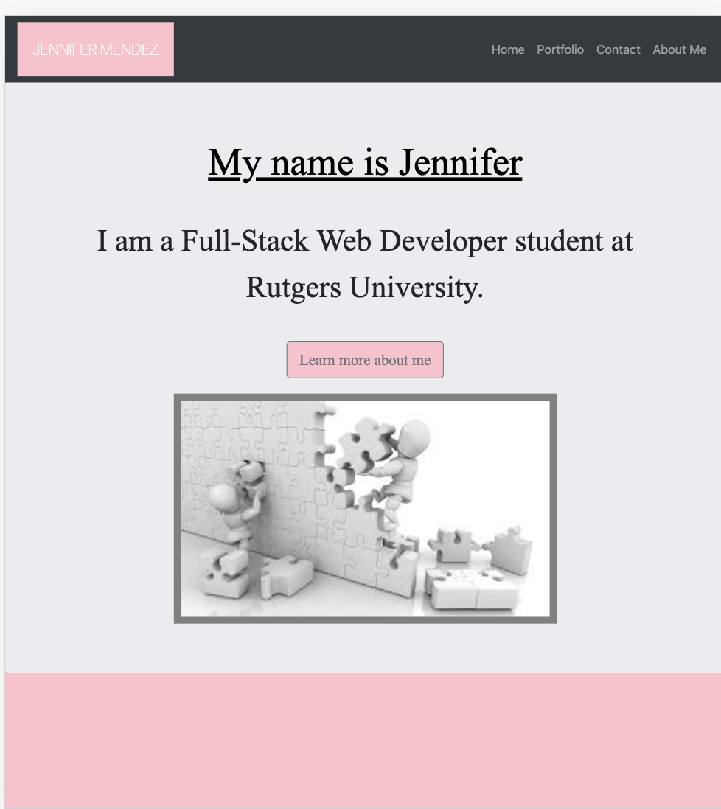
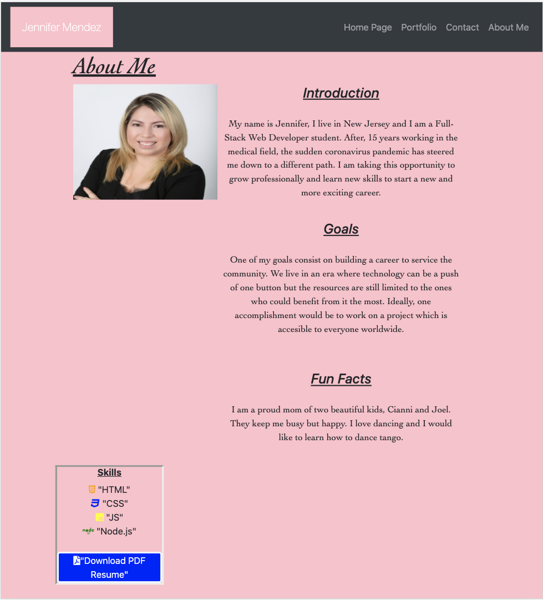
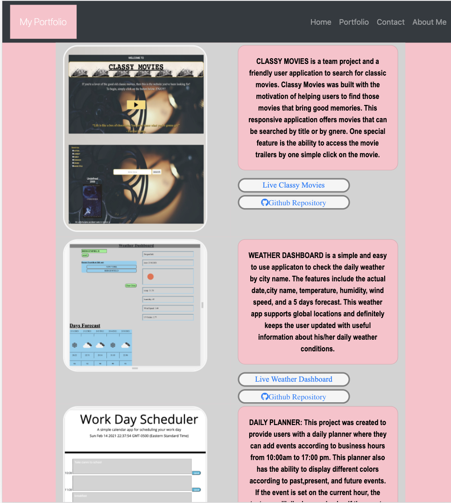
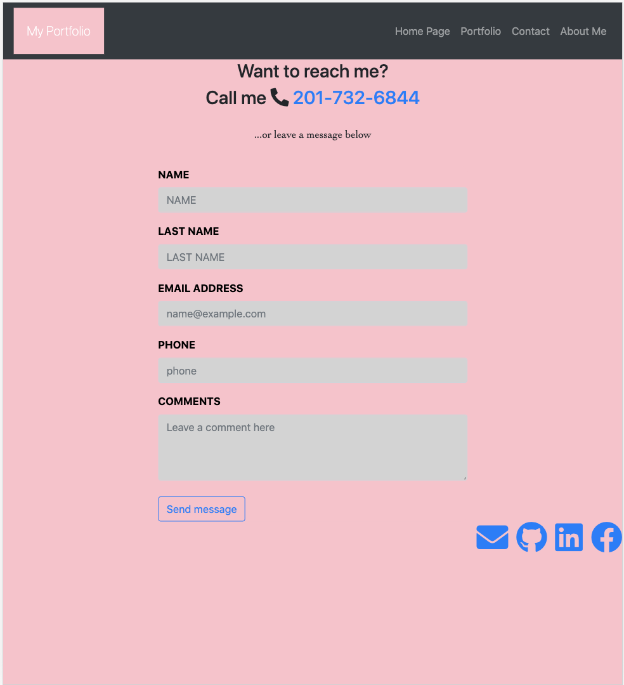

### User Story

As web developer is important to show your work. This project has the intention of showing the skills as future web developer and create a good impression before potential employers.

### Description

This portfolio has a home page, a portfolio page, a contact page, and finnaly an about me page.
The most remarkable page is the portfolio because this is the page where at least three projects are listed. This page also has corresponding links to a live website and a github respository.
The about me page has a quick review of the Web Developer and highlites some of her/his skills.
The contact page provides to the future employer an easy way to contact the qualified prospect.

### Tools

Bootstrap CSS Framework https://getbootstrap.com/docs/5.0/getting-started/introduction/.
Visual Studio Code https://code.visualstudio.com.
Markup Validation Service https://validator.w3.org/.

### Images

 
  
   
    

### Links

### <https://github.com/jenniferjael/Portfolio>
### <https://jenniferjael.github.io/Portfolio/>